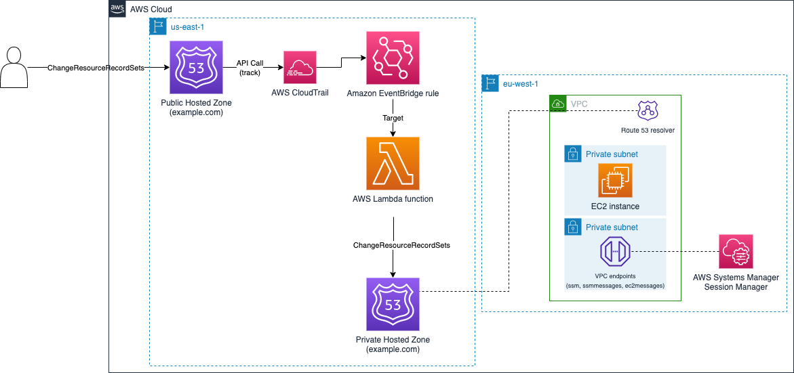

# Amazon Route53 Hosted Zone record replication (Public to Private) - Terraform

## Deployment instructions

* Clone the repository
* Modify *variables.tf* to add the Public Hosted Zone ID and name, and the list of aliases that shouldn't be synced with the Private Hosted Zone.
* To change the values of the VPC resources created, modify *locals.tf* file. 
* Initialize Terraform using `terraform init`.
* You can remove the resources by using `terraform destroy`

## Pre-Requisites

* An AWS Account with an IAM user that has appropriate permissions.
* An Amazon Route 53 Public Hosted Zone, as the IaC examples will ask for its zone ID and name.
* Terraform installed.

## Security

See [CONTRIBUTING](../CONTRIBUTING.md#security-issue-notifications) for more information.

## License

This library is licensed under the MIT-0 License. See the LICENSE file.