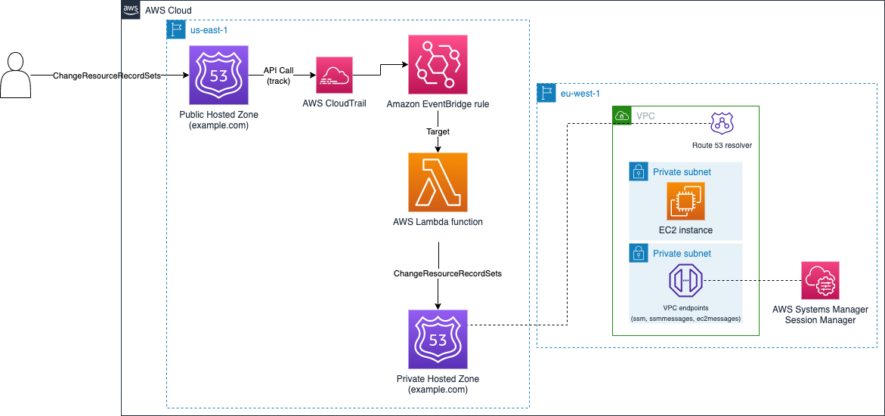

<!-- BEGIN_TF_DOCS -->
# Amazon Route53 Hosted Zone record replication (Public to Private) - Terraform

## Deployment instructions

* Clone the repository
* Modify *variables.tf* to add the Public Hosted Zone ID and name, and the list of aliases that shouldn't be synced with the Private Hosted Zone.
* To change the values of the VPC resources created, modify *locals.tf* file.
* Initialize Terraform using `terraform init`.
* You can remove the resources by using `terraform destroy`

## Pre-Requisites

* An AWS Account with an IAM user that has appropriate permissions.
* An Amazon Route 53 Public Hosted Zone, as the IaC examples will ask for its zone ID and name.
* Terraform installed.

## Security

See [CONTRIBUTING](../CONTRIBUTING.md#security-issue-notifications) for more information.

## License

This library is licensed under the MIT-0 License. See the LICENSE file.

## Requirements

| Name | Version |
|------|---------|
|  [terraform](#requirement\_terraform) | >= 1.3.0 |
|  [aws](#requirement\_aws) | >= 3.73.0 |
|  [awscc](#requirement\_awscc) | >= 0.15.0 |

## Providers

| Name | Version |
|------|---------|
|  [archive](#provider\_archive) | 2.2.0 |
|  [aws](#provider\_aws) | 4.48.0 |
|  [aws.awsmain](#provider\_aws.awsmain) | 4.48.0 |
|  [aws.awsnvirginia](#provider\_aws.awsnvirginia) | 4.48.0 |

## Modules

| Name | Source | Version |
|------|--------|---------|
|  [vpc](#module\_vpc) | aws-ia/vpc/aws | 3.1.0 |

## Resources

| Name | Type |
|------|------|
| [aws_cloudwatch_event_rule.eventbridge_rule](https://registry.terraform.io/providers/hashicorp/aws/latest/docs/resources/cloudwatch_event_rule) | resource |
| [aws_cloudwatch_event_target.lambda_target](https://registry.terraform.io/providers/hashicorp/aws/latest/docs/resources/cloudwatch_event_target) | resource |
| [aws_cloudwatch_log_group.lambda_log_group](https://registry.terraform.io/providers/hashicorp/aws/latest/docs/resources/cloudwatch_log_group) | resource |
| [aws_iam_instance_profile.ec2_instance_profile](https://registry.terraform.io/providers/hashicorp/aws/latest/docs/resources/iam_instance_profile) | resource |
| [aws_iam_policy.lambda_policy](https://registry.terraform.io/providers/hashicorp/aws/latest/docs/resources/iam_policy) | resource |
| [aws_iam_policy_attachment.lambda_policy_attachment](https://registry.terraform.io/providers/hashicorp/aws/latest/docs/resources/iam_policy_attachment) | resource |
| [aws_iam_policy_attachment.ssm_iam_role_policy_attachment](https://registry.terraform.io/providers/hashicorp/aws/latest/docs/resources/iam_policy_attachment) | resource |
| [aws_iam_role.lambda_role](https://registry.terraform.io/providers/hashicorp/aws/latest/docs/resources/iam_role) | resource |
| [aws_iam_role.role_ec2](https://registry.terraform.io/providers/hashicorp/aws/latest/docs/resources/iam_role) | resource |
| [aws_instance.ec2_instance](https://registry.terraform.io/providers/hashicorp/aws/latest/docs/resources/instance) | resource |
| [aws_lambda_function.lambda_route53_function](https://registry.terraform.io/providers/hashicorp/aws/latest/docs/resources/lambda_function) | resource |
| [aws_lambda_permission.allow_eventbridge_rule](https://registry.terraform.io/providers/hashicorp/aws/latest/docs/resources/lambda_permission) | resource |
| [aws_route53_zone.private_hostedzone](https://registry.terraform.io/providers/hashicorp/aws/latest/docs/resources/route53_zone) | resource |
| [aws_security_group.vpc_sg](https://registry.terraform.io/providers/hashicorp/aws/latest/docs/resources/security_group) | resource |
| [aws_vpc_endpoint.endpoint](https://registry.terraform.io/providers/hashicorp/aws/latest/docs/resources/vpc_endpoint) | resource |
| [archive_file.python_lambda_package](https://registry.terraform.io/providers/hashicorp/archive/latest/docs/data-sources/file) | data source |
| [aws_ami.amazon_linux](https://registry.terraform.io/providers/hashicorp/aws/latest/docs/data-sources/ami) | data source |
| [aws_iam_policy_document.lambda_assum_role_policy](https://registry.terraform.io/providers/hashicorp/aws/latest/docs/data-sources/iam_policy_document) | data source |
| [aws_iam_policy_document.lambda_policy_document](https://registry.terraform.io/providers/hashicorp/aws/latest/docs/data-sources/iam_policy_document) | data source |
| [aws_iam_policy_document.policy_document](https://registry.terraform.io/providers/hashicorp/aws/latest/docs/data-sources/iam_policy_document) | data source |

## Inputs

| Name | Description | Type | Default | Required |
|------|-------------|------|---------|:--------:|
|  [alias\_dont\_update](#input\_alias\_dont\_update) | Alias(es) to not update between Hosted Zones | `string` | n/a | yes |
|  [public\_hosted\_zone\_id](#input\_public\_hosted\_zone\_id) | Public Hosted Zone ID - the source. | `string` | n/a | yes |
|  [zone\_name](#input\_zone\_name) | Public Hosted Zone name - to create the Private Hosted Zone. | `string` | n/a | yes |
|  [aws\_region](#input\_aws\_region) | AWS Region to use. | `string` | `"eu-west-2"` | no |
|  [identifier](#input\_identifier) | Project identifier. | `string` | `"route53-hostedzone-sync"` | no |

## Outputs

No outputs.
<!-- END_TF_DOCS -->